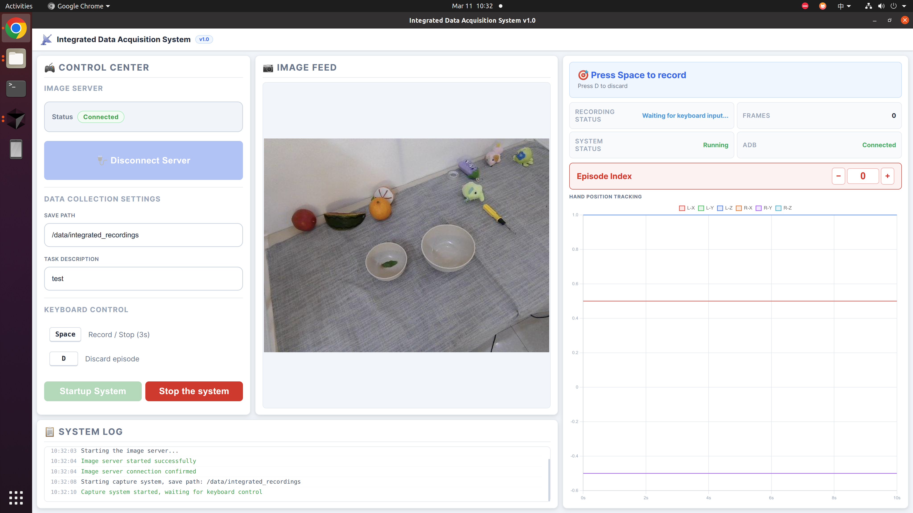
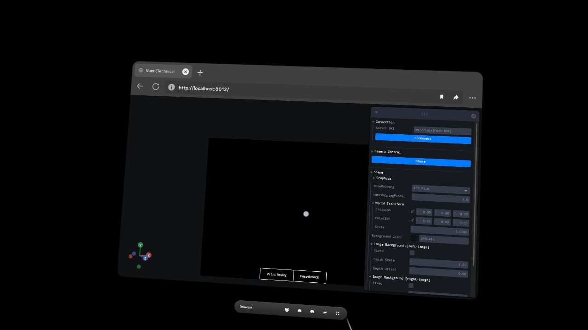
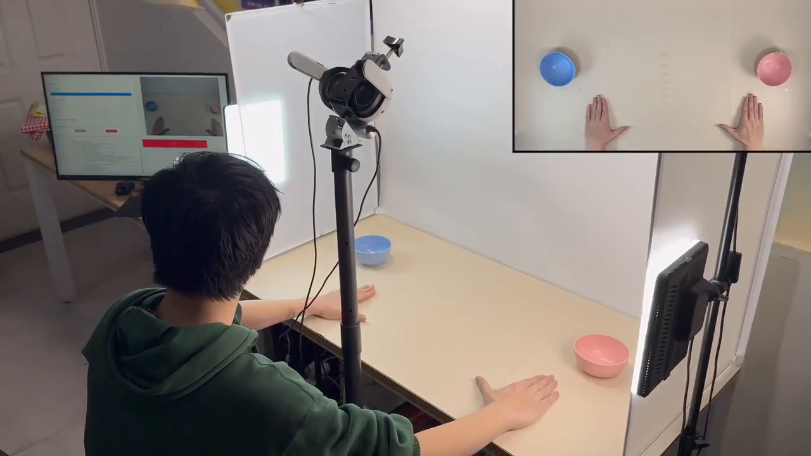
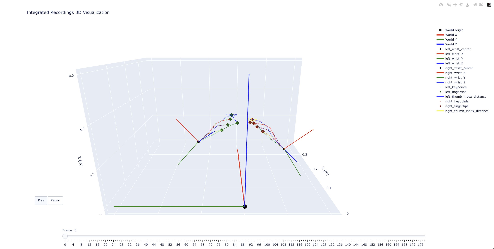

# Human Data Collection

The data collection submodule of [**SimHum**](https://kaipengfang.github.io/sim-and-human/). Captures egocentric hand motion via VR tracking and depth camera images, producing HDF5 episodes for the training pipeline.

## Overview

After completing hardware assembly and environment setup (sections 1–2), the typical workflow is:

```bash
conda activate H_data_col
bash scripts/start_gui_web.sh      # Launch Web GUI at http://localhost:8000
```

Then in the Web GUI: **Connect to Server** → **Startup System** → open `http://localhost:8012/` on Quest 3 → press `Space` to record.

---

## 1. Hardware

<p align="center">
  
</p>

| Component | Role |
|-----------|------|
| **Meta Quest 3** | Bimanual hand tracking (25 keypoints/hand, 30 Hz) |
| **DaBai DCW 1** | Egocentric depth camera |
| **Mounting bracket** | Fixes both devices on a stand above the workspace |
| **Foot pedal** *(optional)* | USB pedal for start/stop recording |

**Assembly:** Mount the depth camera on the lower bracket, Quest 3 on the upper mount (both facing the same direction). Connect the camera to the host via USB 3.0.

---

## 2. Setup

### Dependencies

```bash
cd human_data_collection
bash scripts/setup_env.sh
conda activate H_data_col
```

Creates conda environment `H_data_col` (Python 3.11) with all dependencies from `requirements.txt`. If the environment already exists, the script will ask whether to recreate or update.

### Meta Quest 3

The system communicates with Quest 3 via ADB reverse port forwarding. The Quest browser connects to a local [Vuer](https://github.com/vuer-ai/vuer) server (HTTPS on port 8012) for hand tracking.

**Prerequisites:**
- ADB installed (`sudo apt install android-tools-adb` if not available)
- Developer Mode enabled on Quest 3 (Meta Quest app → Settings → Developer)
- Quest 3 connected via USB data cable

**Verify connection:**

```bash
adb devices    # Should show your device with status "device"
```

Port forwarding (`adb reverse tcp:8012 tcp:8012`) is handled automatically on system startup.

### Camera Configuration

Find your camera device ID (`ls /dev/video*`), then set `head_camera_id_numbers` in `server/server_api.py` (line 75-80):

```python
config = {
    'fps': 30,
    'head_camera_type': 'opencv',
    'head_camera_image_shape': [480, 640],
    'head_camera_id_numbers': [0],       # <- your /dev/video* number
}
```

> Not all `/dev/video*` entries are usable cameras — try different numbers if the image is blank.

---

## 3. Usage

### Start the System

```bash
bash scripts/start_gui_web.sh      # Opens http://localhost:8000
```

1. In the Web GUI (left image below), click **Connect to Server**, then **Startup System**. The SYSTEM LOG panel at the bottom will show startup progress — wait until you see "Capture system started, waiting for keyboard control".
2. Verify that the **IMAGE FEED** panel displays a live camera stream, and the **HAND POSITION TRACKING** chart on the right begins updating with real-time wrist coordinates.
3. On Quest 3, open `http://localhost:8012/` in the browser. You will see the Vuer interface (right image below) — click the **Virtual Reality** button at the bottom center to enter VR mode, then raise both hands to confirm tracking is active.

<p align="center">
  &nbsp;&nbsp;
  
</p>
<p align="center"><i>Left: Web GUI — control center, live camera feed, recording status, and hand tracking chart. Right: Vuer interface on Quest 3 browser.</i></p>

### Data Collection

The camera and Quest 3 are mounted on a fixed stand above the workspace (see image below). The operator sits in front of the stand and performs manipulation tasks with both hands. The system simultaneously captures the egocentric camera view (top-right inset) and full hand pose data via VR tracking.

<p align="center">
  
</p>

| Key | Action |
|-----|--------|
| `Space` | Start / stop recording |
| `D` | Discard current recording |

> **Tip:** We recommend binding `Space` to a USB foot pedal so the operator can start/stop recording without taking hands off the workspace.

```
            Space            3s             Space
WAITING ──────────► PREPARE ───► RECORDING ──────► QUALITY CHECK ──► SAVED
                                     │                    │
                                     │ [D]                │ Failed
                                     └───────────────► DISCARD ──► WAITING
```

- **Start:** `Space` triggers a 3-second countdown (press again to cancel). Data capture begins after countdown.
- **Stop:** `Space` stops recording. The last 3 s are auto-trimmed, then quality checks run. Passed episodes are saved automatically.
- **Discard:** `D` discards the current episode immediately. Episode number stays unchanged for retry.

**Quality checks** — episodes are auto-validated on stop; failures are discarded with a diagnostic message:

| Check | Rule |
|-------|------|
| Minimum duration | >= 3 s |
| Hand stillness | No >30 consecutive static frames (wrist displacement < 0.5 mm) |

### Stop the System

Press `Ctrl+C` in the terminal. To manually clean up residual processes: `bash scripts/cleanup.sh`

> On next startup, the GUI will prompt to clean up residual processes from the previous session.

---

## 4. Data Format

Each episode is saved as an HDF5 file:

```
episode_N.hdf5
├── observation/
│   ├── timestamp              # (T,) frame timestamps
│   └── image/
│       └── head               # (T,) JPEG-encoded head camera images
├── action/
│   ├── left_eef               # (T, 7) left wrist pose [x,y,z,qx,qy,qz,qw]
│   ├── right_eef              # (T, 7) right wrist pose
│   ├── left_gripper           # (T,) left hand open/close [0, 1]
│   └── right_gripper          # (T,) right hand open/close [0, 1]
└── raw/
    ├── head_mat               # (T, 4, 4) head transformation matrix
    ├── left_wrist_mat         # (T, 4, 4) relative left wrist matrix
    ├── right_wrist_mat        # (T, 4, 4) relative right wrist matrix
    ├── left_keypoints         # (T, 25, 3) left hand keypoints
    └── right_keypoints        # (T, 25, 3) right hand keypoints
```

**Metadata:** `description`, `embodiment`, `created_at` (ISO), `freq` (30 Hz).

- **`action/`** — Processed data for policy training. Wrist pose: 7D position + quaternion from 4x4 matrix. Gripper: thumb-to-fingertip distance mapped from [2cm, 12cm] to [0, 1].
- **`raw/`** — Original tracking data for further processing.

---

## 5. Visualization

Interactive 3D visualization of recorded episodes with frame-by-frame playback:

```bash
python visualize_integrated_data.py -f data/integrated_recordings/test/episode_0.hdf5
python visualize_integrated_data.py -f data/integrated_recordings/test/episode_0.hdf5 -o output.html
```

<p align="center">
  
</p>

Renders wrist coordinate frames, 25-point hand skeletons (color-coded by finger), and thumb-index distance with proximity coloring.

---

## Acknowledgments

Built upon [OpenTeleVision](https://robot-tv.github.io/) and [Vuer](https://github.com/vuer-ai/vuer).
